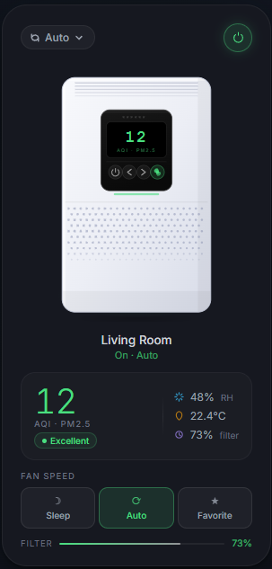

# Xiaomi Air Purifier Card

A custom Lovelace card for Home Assistant that displays Xiaomi MIoT air purifiers with smooth animations, AQI-based color theming, and full fan control.



## Features

- 🌀 Animated fan that spins faster with higher speed modes
- 🌈 Accent color changes automatically based on AQI / PM2.5 level
- 📊 Shows PM2.5, humidity, temperature and filter life
- 🎛️ Toggle power, switch modes (Auto / Sleep / Favorite) directly from the card
- ✨ Floating particles and LED animations when device is on
- 🔧 Auto-detects all sensor entities from the main fan entity ID

## Installation

### HACS (recommended)

1. Open HACS → Frontend → Custom Repositories
2. Add `https://github.com/YOUR_USERNAME/xiaomi-air-purifier-card` as **Lovelace**
3. Install **Xiaomi Air Purifier Card**
4. Reload browser

### Manual

1. Copy `xiaomi-air-purifier-card.js` to `/config/www/`
2. Go to **Settings → Dashboards → Resources** → Add resource:
   - URL: `/local/xiaomi-air-purifier-card.js`
   - Type: `JavaScript Module`
3. Reload browser

## Configuration

### Minimal

```yaml
type: custom:xiaomi-air-purifier-card
entity: fan.zhimi_mc2_f0a6_air_purifier
```

### Full

```yaml
type: custom:xiaomi-air-purifier-card
entity: fan.zhimi_mc2_f0a6_air_purifier
name: Living Room             # optional — overrides friendly name
color: "#38bdf8"              # optional — fixed accent color (default: auto from AQI)
entity_pm25: sensor.XXX       # optional — override auto-detected sensor
entity_humidity: sensor.XXX
entity_temperature: sensor.XXX
entity_filter: sensor.XXX
```

### Multiple purifiers

```yaml
type: horizontal-stack
cards:
  - type: custom:xiaomi-air-purifier-card
    entity: fan.zhimi_mc2_f0a6_air_purifier
    name: Living Room
  - type: custom:xiaomi-air-purifier-card
    entity: fan.zhimi_mc2_a1b2_air_purifier
    name: Bedroom
  - type: custom:xiaomi-air-purifier-card
    entity: fan.zhimi_mc2_c3d4_air_purifier
    name: Bathroom
```

## Entity Auto-Detection

The card derives all sensor entities automatically from the main fan entity:

| Sensor | Auto-detected as |
|--------|-----------------|
| PM2.5  | `sensor.{base}_pm2_5` |
| Humidity | `sensor.{base}_humidity` |
| Temperature | `sensor.{base}_temperature` |
| Filter life | `sensor.{base}_filter_life` |

Where `{base}` is the fan entity ID without `fan.` prefix and `_air_purifier` suffix.

Example: `fan.zhimi_mc2_f0a6_air_purifier` → base = `zhimi_mc2_f0a6`

## AQI Color Scale

| PM2.5 | Color | Label |
|-------|-------|-------|
| 0–12 | 🟢 Green | Excellent |
| 13–35 | 🟩 Light green | Good |
| 36–55 | 🟡 Amber | Moderate |
| 56–150 | 🟠 Orange | Unhealthy |
| 150+ | 🔴 Red | Hazardous |

## Requirements

- Home Assistant 2023.1+
- Xiaomi MIoT integration (HACS) or Xiaomi Miio integration
- Fan entity with `preset_modes`: Auto, Sleep, Favorite

## License

MIT
